<div align="center">

# South Australia Gaming Machine Statistics

**An explorer for South Australia's gaming-machine statistics**, consolidated from the Consumer and Business Services (CBS) releases for FY 2009/10 to FY 2024/25: statewide revenue and tax, council areas, licences and manufacturers.

**Live site:** [sa-gaming-machine-stats.vercel.app](https://sa-gaming-machine-stats.vercel.app)

[](https://github.com/rNLKJA/South-Australia-Gaming-Machine-Statistics/actions/workflows/ci.yml)
[](https://nextjs.org/)
[-1f6feb>)](https://www.cbs.sa.gov.au/sections/LGL/gaming-statistics)
[](LICENSE)

</div>

## Overview

South Australia's gambling regulator publishes its gaming-machine figures as separate PDF releases: a monthly statewide report, quarterly licence statistics, manufacturer counts and an annual breakdown by local government area (LGA). That format makes a trend across more than a decade hard to see.

In September 2025 I collected about 110 of those releases, transcribed them into one Excel workbook and built a Power BI report on it. In 2026 I rebuilt the project as a website so anyone can explore it in a browser. The website keeps the original figures and adds what the first version lacked:

- **Every figure checked against its PDF.** A script finds 4,406 of the 4,409 workbook values in the release they came from; the three exceptions (and one scanned PDF) are listed on the site.
- **Combined council groups rebuilt.** CBS publishes small councils as combined groups. The workbook had divided each group equally across its members; the site puts the groups back together, maps them as one shape and never shows the equal split as a council's own figure.
- **A documented council-name crosswalk** from the 94 names in the workbook to ABS Local Government Areas (2024).
- **Corrected yearly totals.** The Power BI pages summed monthly snapshots (machines, venues, entitlements, shares), which inflates them about twelvefold. The site uses means and end-of-year values and shows both side by side.
- **Gaps and breaks surfaced, not hidden:** the missing FY 2014/15 statewide release, missing months, COVID-19 closures, and a reconciliation of LGA totals against statewide NGR.
- **Real-terms dollars** using the ABS Adelaide CPI, a manufacturer concentration index (HHI), a council map with suburb search, and tidy CSV downloads.

The 2026 upgrade adds the statistics around those figures, without changing them:

- **Every estimate with its uncertainty.** An STL decomposition of monthly NGR, an interrupted time series around the 2020 venue closures (Newey–West intervals, four specifications), paired calendar-month comparisons with effect sizes, and annual NGR per machine and HHI with bootstrap intervals. Sample sizes and seeds are stated next to the numbers.
- **Councils read fairly.** Funnel plots of NGR per machine against the state rate, with control limits scaled by each area's year-to-year variation, so a council with 17 machines is not over-read next to one with 1,100.
- **When concentration turned.** A broken-stick change-point fit to the monthly HHI, with a moving-block bootstrap interval for the turning point.
- **Methods written down.** A Methods page, five decision records, a data card and a model card, rendered from `docs/`.
- **Optional AI with your own key.** Ask the data in plain English: a model you choose (Anthropic or OpenAI, called from your browser with your key) drafts a read-only SQL query that you see and run yourself. Every AI output is labelled, every call goes to an audit log you can export, and an evaluation harness measures how often the model is right.

This is a personal project. It is not affiliated with Consumer and Business Services, the Government of South Australia or my employer, and it takes no position for or against gambling. If gambling is affecting you or someone close to you, call the Gambling Help Line on **1800 858 858** or visit [gamblinghelponline.org.au](https://www.gamblinghelponline.org.au).

## Showcase

### A decade of pokies revenue

Statewide net gambling revenue from FY 2009/10 to FY 2024/25: the missing FY 2014/15 release and the 2020 COVID-19 closures marked and explained, nominal against real dollars, then the interrupted time series that estimates the break at reopening with its interval.

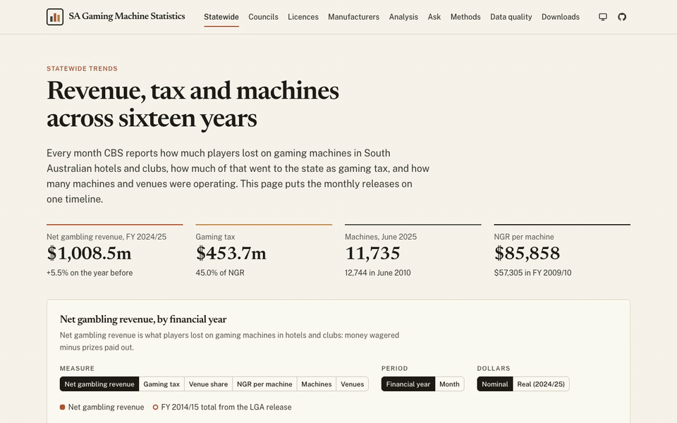

**Walkthrough steps:**

1. Statewide: net gambling revenue for every financial year, FY 2009/10 to FY 2024/25
2. FY 2014/15 has no statewide release: the hollow marker is the total from the LGA release
3. FY 2019/20 is shaded: gaming rooms closed for COVID-19 from late March 2020
4. By month: NGR falls to almost nothing from April to June 2020, then the series resumes
5. Real dollars: deflated by the Adelaide CPI to FY 2024/25 dollars, nominal dashed alongside
6. Both breaks are explained beside the chart rather than smoothed over
7. Analysis: the interrupted time series puts the jump at reopening at +$9.3m a month, 95% CI +$5.8m to +$12.8m
8. Paired months compare like-for-like years, with t and bootstrap intervals and effect sizes

### Where the machines are

The council map and ranking by financial year, combined council groups kept whole, one area's history, then the funnel plot that asks which areas really differ from the state rate once their size is allowed for.

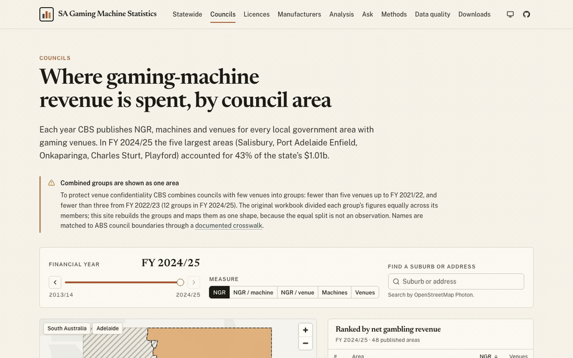

**Walkthrough steps:**

1. Councils: every area CBS published, on a map and in a ranked table
2. Switch the measure to gaming machines in each council area
3. Drag the year slider: the map and the ranking follow each year from FY 2013/14
4. Small councils stay in their combined groups, outlined as one area and never split
5. Select an area: it is highlighted on the map, with its history across the years
6. Analysis: a funnel plot of NGR per machine against the state rate, by number of machines
7. Change the year, then use limits that also allow for the spread between councils
8. Each area's typical ratio to the state rate, with a 95% interval across its years

### Ask the data

Read-only SQL over the eight tidy tables in the browser, then the optional bring-your-own-key text-to-SQL with the generated query shown before it runs (a mocked reply; no real key is used), the AI audit log, and the data-quality checks behind every figure.

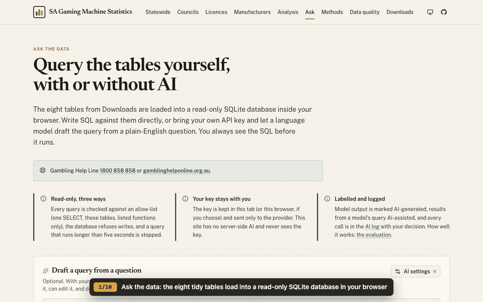

**Walkthrough steps:**

1. Ask the data: the eight tidy tables load into a read-only SQLite database in your browser
2. No key is needed for SQL: run the starter query over the annual figures
3. AI settings: bring your own Anthropic or OpenAI key; it stays in this browser
4. For this demo: a placeholder key, never a real one; calls to the provider are intercepted _(Mocked AI response for illustration)_
5. Pick an example question and draft SQL: the reply is labelled AI-generated _(Mocked AI response for illustration)_
6. Check the drafted SQL, then run it yourself: the result is labelled AI-assisted _(Mocked AI response for illustration)_
7. The AI log records the call, the model and your decision, with JSON and CSV export _(Mocked AI response for illustration)_
8. Forget key: the placeholder is removed from this browser
9. Data quality: 4,406 of 4,409 figures found in the CBS PDFs, with the exceptions listed
10. The Power BI totals summed monthly snapshots; the site uses means and June values instead

### Feature screenshots

<table>
<tr>
<td width="50%">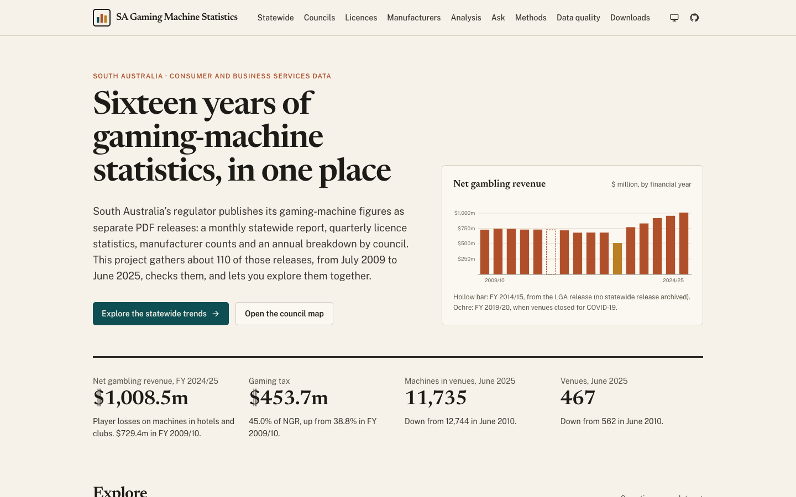<br><sub><b>Landing page.</b> Sixteen years of CBS releases in one place, with the headline figures.</sub></td>
<td width="50%">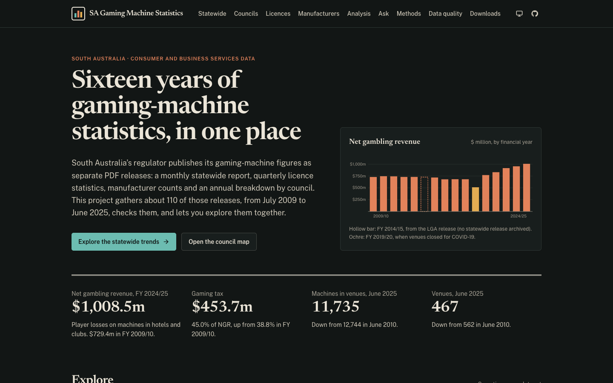<br><sub><b>Landing page, dark mode.</b> The same page in dark mode.</sub></td>
</tr>
<tr>
<td width="50%">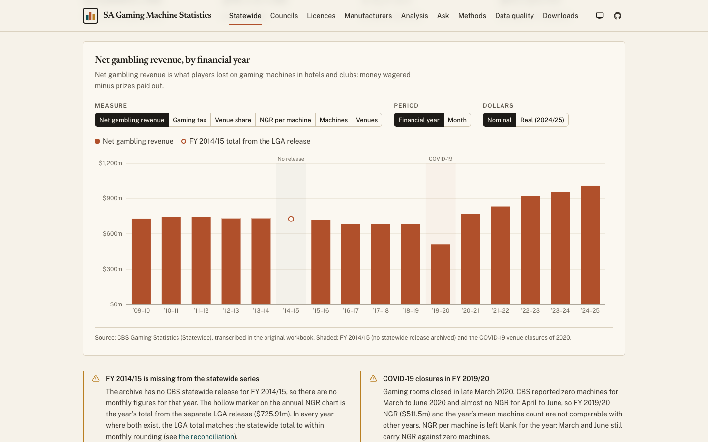<br><sub><b>Statewide trends.</b> Annual NGR with the missing FY 2014/15 release and the 2020 closures marked.</sub></td>
<td width="50%">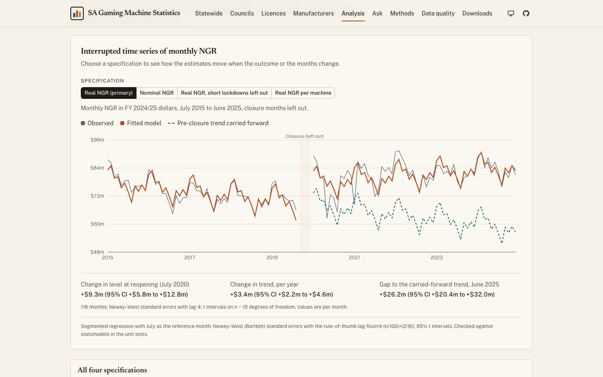<br><sub><b>The 2020 break, with intervals.</b> Interrupted time series of monthly NGR with Newey–West intervals.</sub></td>
</tr>
<tr>
<td width="50%">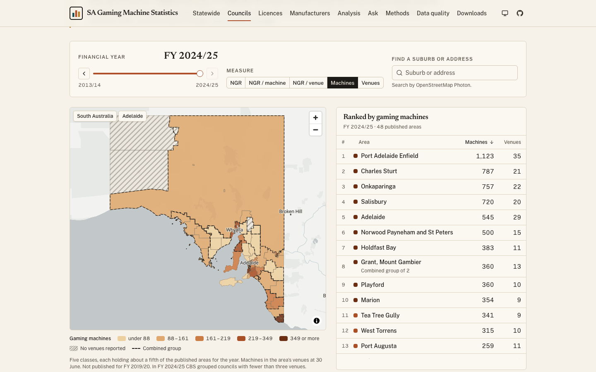<br><sub><b>Council map.</b> Machines by council area, combined groups kept whole, with the ranked table.</sub></td>
<td width="50%">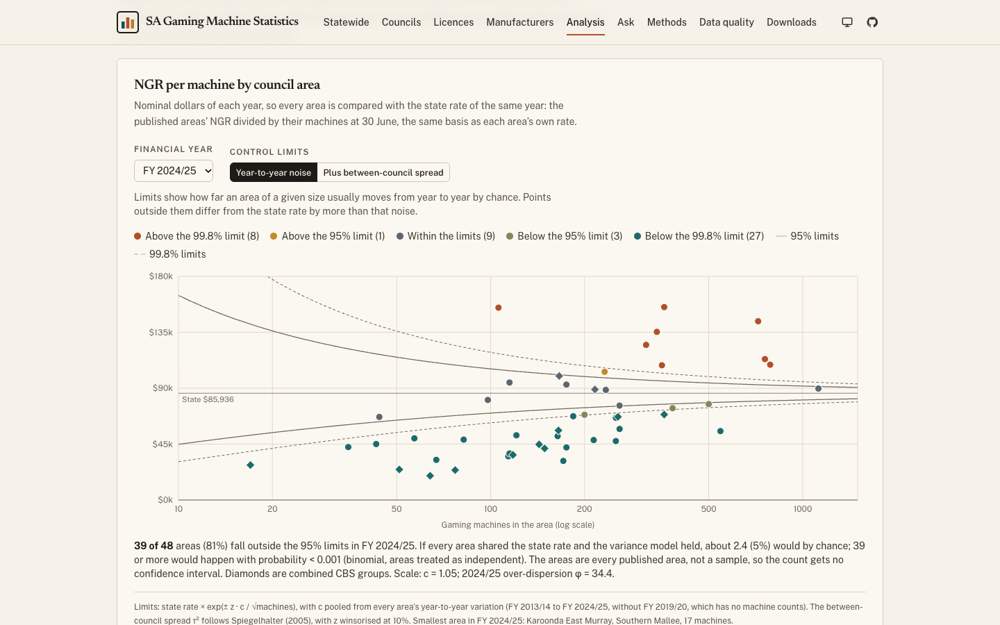<br><sub><b>Funnel plot.</b> NGR per machine against the state rate, with limits scaled by area size.</sub></td>
</tr>
<tr>
<td width="50%">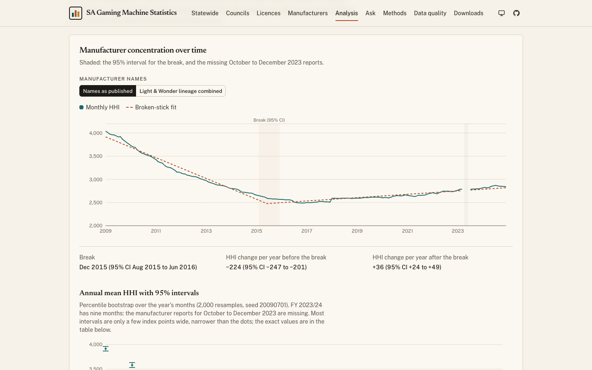<br><sub><b>Manufacturer concentration.</b> Annual HHI with bootstrap intervals and the broken-stick change point.</sub></td>
<td width="50%">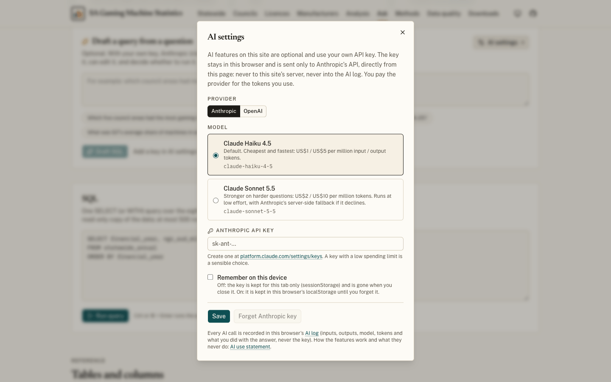<br><sub><b>Bring your own key.</b> AI settings: Anthropic by default, OpenAI optional; the key stays in this browser.</sub></td>
</tr>
<tr>
<td width="50%">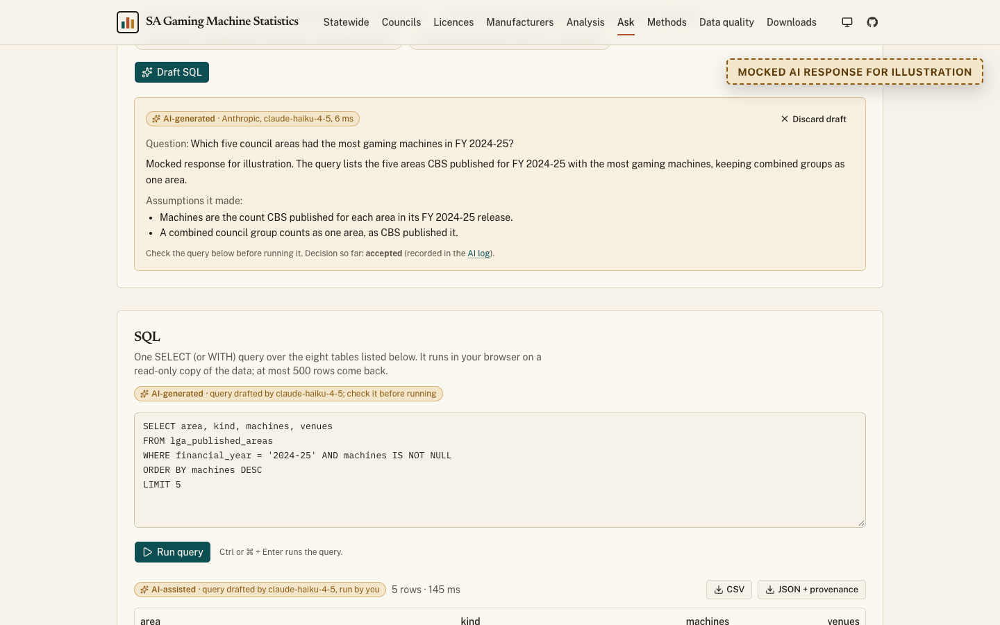<br><sub><b>Ask the data (mocked reply).</b> A mocked draft for illustration: the SQL is shown, labelled and run by you.</sub></td>
<td width="50%">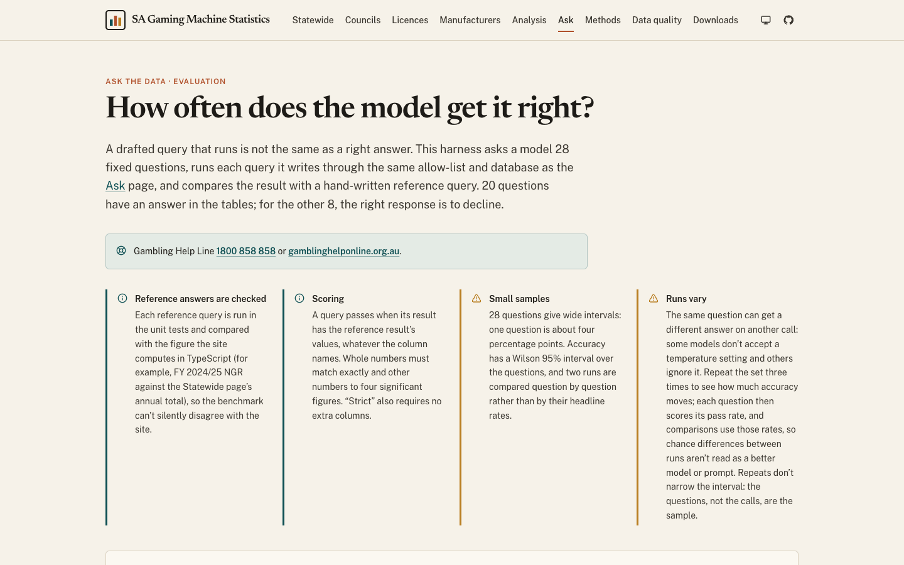<br><sub><b>Text-to-SQL evaluation.</b> 28 fixed questions, execution accuracy with intervals, paired comparisons.</sub></td>
</tr>
<tr>
<td width="50%">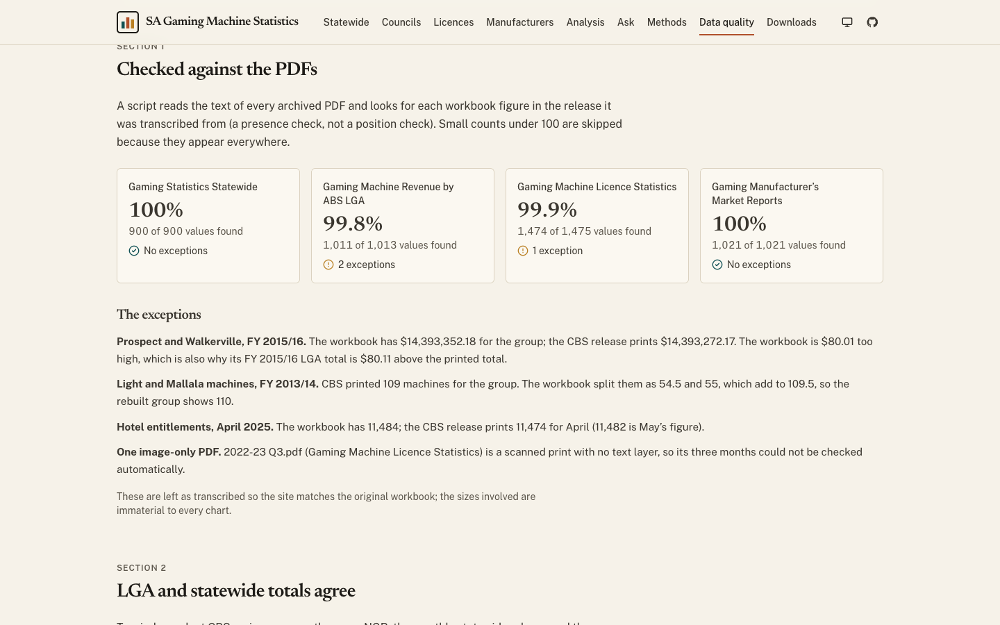<br><sub><b>Data quality.</b> Every figure checked against its PDF; the exceptions and gaps listed.</sub></td>
<td width="50%">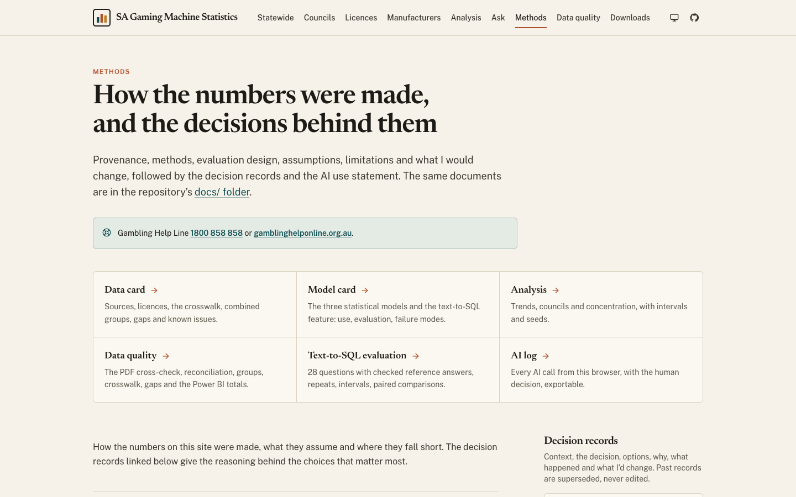<br><sub><b>Methods.</b> Provenance, assumptions, limitations, decision records and the AI use statement.</sub></td>
</tr>
<tr>
<td width="50%">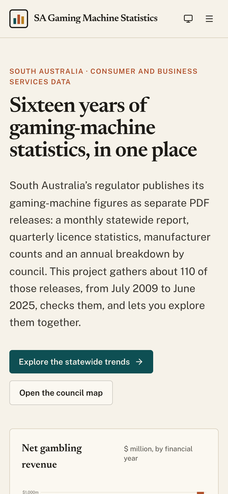<br><sub><b>Mobile: landing.</b> The landing page at 390 px.</sub></td>
<td width="50%">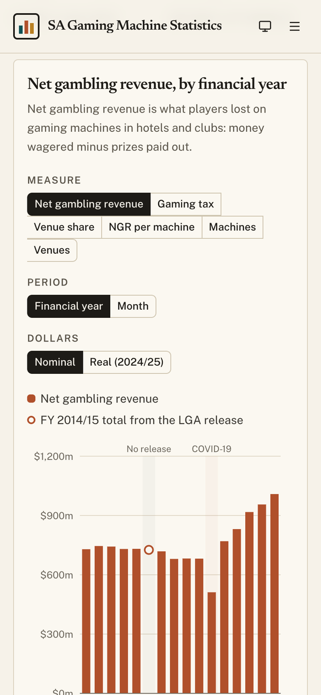<br><sub><b>Mobile: statewide.</b> The NGR chart and its controls on a phone.</sub></td>
</tr>
<tr>
<td width="50%">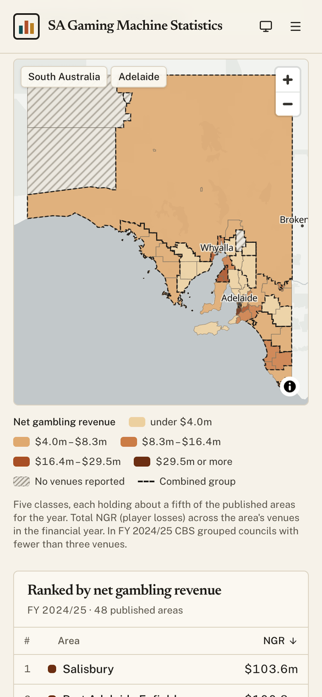<br><sub><b>Mobile: councils.</b> The council map on a phone.</sub></td>
<td width="50%"></td>
</tr>
</table>

**See the full guided tour with videos and more screenshots:** [sa-gaming-machine-stats.vercel.app/tour](https://sa-gaming-machine-stats.vercel.app/tour)

## What's on the site

| Route            | What it shows                                                                                                  |
| ---------------- | -------------------------------------------------------------------------------------------------------------- |
| `/`              | Overview, the headline figures and an about section                                                            |
| `/statewide`     | Monthly and annual NGR, gaming tax, venue share, machines, venues and NGR per machine; nominal or real dollars |
| `/councils`      | MapLibre map and ranked table by council area for each year, combined groups kept whole, suburb search         |
| `/licences`      | Entitlements, live machines, licences and live licences by category                                            |
| `/manufacturers` | Market share over time and the Herfindahl–Hirschman index                                                      |
| `/data-quality`  | PDF cross-check, reconciliation, groups, crosswalk, gaps and the Power BI aggregation issue                    |
| `/downloads`     | Eight derived CSV tables and a read-me with attribution                                                        |

Added in the 2026 upgrade:

| Route                                       | What it shows                                                                                                      |
| ------------------------------------------- | ------------------------------------------------------------------------------------------------------------------ |
| `/analysis`                                 | Headline findings of the three analyses, each with its interval                                                    |
| `/analysis/trends`                          | STL decomposition, interrupted time series around the 2020 closures, paired months, NGR per machine with intervals |
| `/analysis/councils`                        | Funnel plots against the state rate and each area's typical ratio with a 95% interval                              |
| `/analysis/concentration`                   | Annual HHI with bootstrap intervals and the broken-stick change point                                              |
| `/ask`                                      | Read-only SQL over the tidy tables in your browser; optional AI drafting with your own key                         |
| `/ask/evaluation`                           | The text-to-SQL evaluation harness: 28 questions, optional repeats, accuracy with intervals, paired comparisons    |
| `/ai-log`                                   | The AI audit log for this browser, with JSON and CSV export                                                        |
| `/methods`                                  | Methods, the AI use statement and links to the decision records                                                    |
| `/methods/decisions/[record]`               | Decision records DR-001 to DR-006                                                                                  |
| `/methods/data-card`, `/methods/model-card` | The data card and the model card                                                                                   |
| `/tour`                                     | Guided tour: three captioned video walkthroughs and screenshots of every key feature                               |

## Tech stack

| Layer         | Original (2025)                         | Revived (2026)                                                                                                                                                   |
| ------------- | --------------------------------------- | ---------------------------------------------------------------------------------------------------------------------------------------------------------------- |
| Data          | CBS PDFs transcribed into Excel by hand | The same workbook, read by Python scripts run with [uv](https://docs.astral.sh/uv/) (openpyxl, Shapely, pdfplumber)                                              |
| Analysis      | Power BI Desktop                        | TypeScript domain modules in `web/src/lib`, unit-tested with Vitest against the workbook's own pivot tables                                                      |
| Front end     | Power BI report pages                   | Next.js 16 (App Router, static generation), React 19, TypeScript, Tailwind CSS 4, shadcn/ui (Base UI), Recharts, MapLibre GL with OpenFreeMap tiles, next-themes |
| Geocoding     | –                                       | Photon (komoot, OpenStreetMap), called from a cached server route; no keys or accounts                                                                           |
| Deployment    | –                                       | Vercel (static pages plus one serverless route): [sa-gaming-machine-stats.vercel.app](https://sa-gaming-machine-stats.vercel.app)                                |
| Statistics    | –                                       | TypeScript in `web/src/lib/stats`, checked against scipy, statsmodels and R (`scripts/stats_reference.py`, `scripts/stl_reference.R`)                            |
| AI (optional) | –                                       | Bring your own key: Anthropic SDK or OpenAI from the browser, zod validation, sql.js (SQLite in WebAssembly) in a Web Worker, IndexedDB audit log                |

## Repository structure

```
.
├── README.md
├── LICENSE
├── .github/workflows/ci.yml      lint, format, typecheck, test and build on every push
├── docs/                         methods, data card, model card, AI use statement
│   └── decisions/                decision records DR-001 to DR-006
├── original/                     the 2025 archive, unchanged (see original/README.md)
│   ├── SA Gaming Data/           CBS PDFs in four report families
│   ├── SA Gaming Statistics.xlsx the consolidated workbook
│   ├── SA Gaming Dashboard.pbix  the Power BI report
│   ├── README-2025.md            the README as it stood in 2025
│   └── _archive/                 the first README
├── scripts/
│   ├── build_data.py             workbook + Power BI layout + ABS data -> web/src/data, web/public/data
│   ├── verify_pdfs.py            checks every figure against the archived PDFs
│   ├── stats_reference.py        scipy / statsmodels reference values for the statistics tests
│   ├── stl_reference.R           R stats::stl() reference values for the STL port
│   └── lga_crosswalk.csv         hand-checked council name crosswalk
└── web/                          the Next.js app (Vercel root)
    ├── public/data/              simplified ABS council and group boundaries (GeoJSON)
    ├── content/                  copies of docs/ rendered on /methods (pnpm docs:sync; a test checks they match)
    ├── tools/                    sync-docs.mjs
    ├── public/vendor/            the MapLibre and sql.js workers, served as static files
    └── src/
        ├── app/                  routes, layout, metadata, CSV download route, geocode route
        ├── components/           ui/ primitives, layout/, charts/, and one folder per section
        ├── data/                 JSON written by the scripts (do not edit by hand)
        ├── hooks/
        ├── lib/                  framework-free domain logic and its tests
        │   ├── stats/            intervals, bootstrap, OLS with Newey–West, STL, funnel limits, broken stick
        │   ├── analysis/         the trend, council and concentration analyses
        │   ├── sql/              the browser database: load script, allow-list guard, worker engine
        │   └── ai/               provider adapters, key storage, audit log, text-to-SQL prompt and evaluation
        └── server/               server-only helpers (Photon client, markdown docs)
```

## Local development

Requirements: Node.js 20 or later and pnpm 10. Python 3.12 and uv only if you want to regenerate the data.

```bash
cd web
pnpm install
pnpm dev            # http://localhost:3000
```

Quality gates (the same as CI):

```bash
pnpm lint && pnpm format:check && pnpm typecheck && pnpm test && pnpm build
pnpm start -p 3532  # serve the production build
```

`pnpm build` first copies `docs/` into `web/content/` (`pnpm docs:sync`); commit the copies with any change to `docs/`, because Vercel builds from `web/` alone and a unit test fails if they drift. After upgrading sql.js or MapLibre, run `pnpm sync:sqljs` or `pnpm sync:maplibre-worker` (tests check the vendored workers match the installed packages).

No environment variables are required. `NEXT_PUBLIC_SITE_URL` (see `web/.env.example`) optionally sets the absolute URL used in social-sharing metadata.

Deploying: the Vercel project `sa-gaming-machine-stats` has `web/` as its root. From `web/`, `vercel deploy --prod` builds and publishes to [sa-gaming-machine-stats.vercel.app](https://sa-gaming-machine-stats.vercel.app). No keys, secrets or database are involved: the optional AI features use each visitor's own key in their browser.

## Optional AI: bring your own key

The site works fully without AI. On [Ask the data](https://sa-gaming-machine-stats.vercel.app/ask) anyone can write SQL against the eight tidy tables, which are loaded into a read-only SQLite database (sql.js) inside the browser. With their own API key, a visitor can also have a model draft the query from a plain-English question.

- **Your key, your browser.** Open **AI settings**, choose Anthropic (default model Claude Haiku 4.5, with Claude Sonnet 5.5 as an option) or OpenAI (any model id, default `gpt-5-mini`), and paste a key. It is kept in `sessionStorage` (gone when the tab closes) unless you tick "Remember on this device" (`localStorage`); **Forget key** removes it. Requests go straight from the browser to the provider. The key never reaches this site's server, is never logged and is never committed; the content security policy only allows connections to this site, the map tiles and the two providers' APIs.
- **You decide what runs.** The drafted SQL is shown and editable. Every query passes an allow-list (one SELECT or WITH statement over the eight tables, listed functions only, no recursion), runs on a database that refuses writes, and is stopped after five seconds. Model text is labelled **AI-generated** and results from a model's query **AI-assisted**.
- **Audit log.** Every AI call is appended to an IndexedDB log in your browser: id, time, feature, provider, model, input (without the key, with a SHA-256 hash of the prompt and the site build), output, latency, token usage and your decision (accepted, edited or rejected). View and export it as JSON or CSV at [/ai-log](https://sa-gaming-machine-stats.vercel.app/ai-log).
- **Evaluation.** [/ask/evaluation](https://sa-gaming-machine-stats.vercel.app/ask/evaluation) runs 28 fixed questions (8 of which should be declined; the prompt names no examples of them) through the same guard and database and scores execution accuracy against reference queries that the unit tests check against the site's own figures. It can repeat the set three times to show run-to-run variation, reports Wilson intervals by category over the questions (repeats don't narrow them), gives the decline rate separately for the five should-decline questions whose scope the prompt doesn't state, compares two runs question by question, and exports the results. No accuracy figure is published here: there is no budget to run it, so it runs only with a visitor's key.

What the AI does and never does is set out in the AI use statement on [Methods](https://sa-gaming-machine-stats.vercel.app/methods#ai-use-statement), which is informed by the Australian Government's policy for the responsible use of AI in government, the EU AI Act's transparency principles and the NIST AI Risk Management Framework (it does not claim compliance with any of them).

## Methods, decision records and cards

`docs/` holds the written methods and is rendered on the site under `/methods`:

- `docs/methods.md`: provenance, methods, evaluation design, uncertainty conventions, assumptions, limitations and what I'd change.
- `docs/decisions/`: DR-001 combined council groups, DR-002 stock versus flow aggregation (the Power BI sum issue), DR-003 the FY 2014/15 gap, DR-004 browser text-to-SQL, DR-005 the analysis design, DR-006 the evaluation intervals (supersedes part of DR-004). Past records are superseded, never edited.
- `docs/data-card.md` and `docs/model-card.md`: the tidy tables, and the three statistical models plus the text-to-SQL feature.
- `docs/ai-use-statement.md`: the AI use statement.

The statistics helpers are verified against reference values that two scripts regenerate:

```bash
uv run scripts/stats_reference.py   # scipy, statsmodels, numpy -> web/src/lib/stats/__fixtures__/reference.json
Rscript scripts/stl_reference.R     # R stats::stl() -> web/src/lib/stats/__fixtures__/stl-reference.json
```

Every resampled interval uses the seed 20090701 (the first month of the series), so the static pages show the same numbers on every build.

## Viewing the records

The site is read-only and has no server-side database: the derived data is about 1.5 MB of JSON that is imported at build time, so every page except the geocoder is pre-rendered static HTML. To look at the records behind any chart:

- **With SQL:** [Ask the data](https://sa-gaming-machine-stats.vercel.app/ask) loads the same eight tables into a read-only SQLite database in your browser (the load script is served at `/ask/tidy-tables.sql`).
- **On the live site:** [Downloads](https://sa-gaming-machine-stats.vercel.app/downloads) has eight tidy CSV tables (statewide monthly and annual, licences, manufacturers, concentration, published council areas, crosswalk) plus a read-me with notes and attribution.
- **In the repository:** `web/src/data/*.json` holds every row the site uses, and `web/public/data/*.geojson` the council and group boundaries (open them in any GeoJSON viewer, such as geojson.io).
- **At the source:** `original/SA Gaming Statistics.xlsx` is the hand-transcribed workbook the scripts read; its INFO sheet holds the pivot tables the unit tests compare against.

## How the data is generated

Everything the site shows is derived from the original workbook by two scripts, both run from the repository root. Their dependencies are declared inline (PEP 723), so `uv run` installs them in a throwaway environment.

```bash
uv run scripts/build_data.py            # add --refresh to re-download the ABS inputs
uv run scripts/verify_pdfs.py
```

`build_data.py`

1. Reads the four data sheets of `original/SA Gaming Statistics.xlsx` (only the non-empty rows; the revenue sheet's used range is padded to about a million rows) and the INFO sheet's pivot tables, which the unit tests use as parity targets.
2. Rebuilds the rows CBS actually published from the LGA sheet: rows of one year with identical NGR and NGR per venue are one published row, mapped through `scripts/lga_crosswalk.csv` to ABS 2024 council codes.
3. Downloads the ABS ASGS Edition 3 (2024) LGA boundaries for South Australia (no key) and simplifies them as a coverage so neighbouring councils still share edges; dissolves every combined group into one shape.
4. Downloads the ABS Consumer Price Index for Adelaide (All groups, quarterly) from the ABS Data API (no key).
5. Reads the visual definitions from the Power BI file's report layout.
6. Writes small JSON files to `web/src/data/` and GeoJSON to `web/public/data/` (about 1.4 MB in total, much less compressed).

`verify_pdfs.py` extracts the text of every archived PDF with pdfplumber and looks for each figure in the release it was transcribed from, then writes `web/src/data/verification.json`, which the Data quality page reports.

The CSV downloads are not stored: they are generated at build time by `web/src/lib/downloads.ts`, the same code that draws the charts.

## Data sources and licences

- **Gaming statistics:** Consumer and Business Services, Government of South Australia, [gaming statistics](https://www.cbs.sa.gov.au/sections/LGL/gaming-statistics). The CBS PDFs are kept in `original/` as the evidence trail for the workbook; the website does not serve them. Treat the CBS website as authoritative.
- **Council boundaries:** Australian Bureau of Statistics, ASGS Edition 3 Local Government Areas 2024, CC BY 4.0.
- **Consumer Price Index:** Australian Bureau of Statistics, CC BY 4.0.
- **Basemap:** [OpenFreeMap](https://openfreemap.org/), © OpenMapTiles, © OpenStreetMap contributors. If the tiles can't load, the map falls back to the bundled council boundaries.
- **Code:** MIT ([LICENSE](LICENSE)), including the code that consolidates and derives the tables. The figures themselves remain CBS's and the ABS's; I could not confirm CBS's reuse terms, so attribute CBS and check its copyright statement before reusing them (see the [data card](docs/data-card.md)).

## Provenance

The original 2025 archive (PDFs, workbook and Power BI report) is preserved unchanged in [`original/`](original/), moved there with `git mv` so its history is intact. The website does not alter the workbook's figures: where the PDF check found a transcription difference, the site keeps the workbook value and lists the difference on the Data quality page.

## Credits

Built by Sunchuangyu (Rin) Huang ([@rNLKJA](https://github.com/rNLKJA)), with help from Claude Code for the 2026 revival.

<p align="right">2025–2026 @rNLKJA</p>
